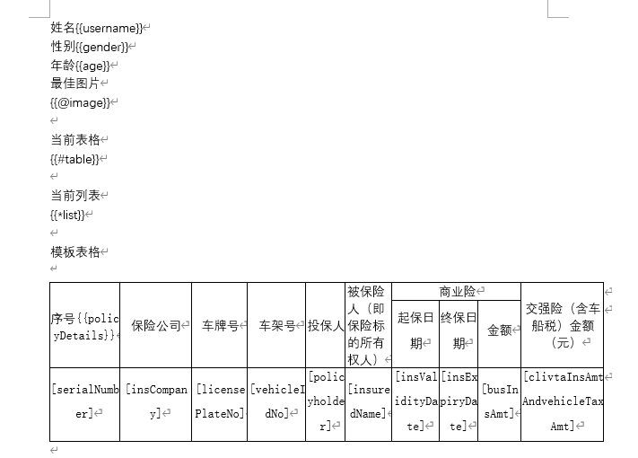

# POI模块

官方地址: http://deepoove.com/poi-tl

## 概述

基于POI-TL二次封装，使word模板渲染操作尽可能的便捷。

## 默认配置

默认占位符方式{{xxx}}，若需替换默认占位符。参考如下代码

```java
	   //设置渲染格式 全局生效,只需项目启动时设置一次即可
		PoiGlobalConfig.setConfigureSupplier(() -> {
            ConfigureBuilder builder = Configure.builder();
            builder.buildGramer("{", "}");
            Configure configure = builder.build();
            return configure;
        });
```

## Word模板



## 使用说明

### 核心工具类

PoiTemplate: 非静态工具类，支持注册成bean

PoiUtil: 静态工具类，功能等同PoiTemplate。

PoiGlobalConfig: 全局配置，对以上两种工具类皆生效。

> 若需要更改全局配置，可以参考如下注册时机。

```java
	@Bean
	public PoiTemplate poiTemplate(){
		//设置渲染格式 全局生效
		PoiGlobalConfig.setConfigureSupplier(() -> {
            ConfigureBuilder builder = Configure.builder();
            builder.buildGramer("{", "}");
            Configure configure = builder.build();
            return configure;
        });
		PoiTemplate poiTemplate = PoiTemplate.INSTANCE;
		return poiTemplate;
	}
```

### 1.引入依赖

```xml
		<dependency>
				<groupId>com.lovecyy</groupId>
				<artifactId>relaxed-third-poi</artifactId>
				<version>${latestVersion}</version>
		</dependency>
```

### 2.单元测试

#### 公共变量

```java
// word模板路径	
String templatePath = "D:\\profile\\test.docx";
//渲染目标路径
String destPath = "D:\\profile\\test_" + RandomUtils.nextInt() + ".docx";
//图片路径
String imgPath = "D:\\profile\\微信图片_20231205172145.jpg";
```

#### 一、数据构造

```java
// 普通文本
		TextContentData textContentData = PoiDataHelper.Text.builder().labelName("username").content("张三").build();
		// 超链接
		TextContentData genderTextContentData = PoiDataHelper.Text.builder().labelName("gender").content("女")
				.url("https://www.baidu.com").build();
		// 自定义样式
		TextContentData ageTextContentData = PoiDataHelper.Text.builder().labelName("age")
				.custom(Texts.of("Sayi").color("00FF00").create()).build();
		// 图片
		PicContentData picContentData = PoiDataHelper.PICTURE.builder().labelName("image").width(100).height(100)
				.file(new File(imgPath)).build();
		// 表格
		TableContentData tableContentData = PoiDataHelper.TABLE.builder().labelName("table")
				.headers(Arrays.asList("班级", "排名")).headerStyle().bgColor("4472C4").textColor("FFFFFF").center().build()
				.addContent(Arrays.asList("科教1班", "1")).addContent(Arrays.asList("幼儿3班", "6"))
				.addContent(Arrays.asList("科教1班", "1")).build();
		// 列表
		ListContentData listContentData = PoiDataHelper.LIST.builder().labelName("list").addContent("排序1")
				.addContent("排序2").addContent("排序3").addContent("排序4").build();
		// 模板列表
		List<TestData> loopDatas = new ArrayList<>();
		loopDatas.add(mockTestLoopData());
		loopDatas.add(mockTestLoopData());
		LoopRowTableContentData loopRowTableContentData = PoiDataHelper.LOOP_ROW_TABLE.<TestData>builder()
				.labelName("policyDetails").prefix("[").suffix("]").dataStartRow(2).dataList(loopDatas).build();
```

#### 二、执行渲染

```java
List<LabelData> contents = new ArrayList<>();
		contents.add(textContentData);
		contents.add(genderTextContentData);
		contents.add(ageTextContentData);
		contents.add(picContentData);
		contents.add(tableContentData);
		contents.add(listContentData);
		contents.add(loopRowTableContentData);
//结构化数据渲染word
PoiUtil.renderWord(new File(templatePath), new File(destPath), contents);
//非结构化数据渲染word,支持直接指定map数据
Map<String,Object> dataMap=new HashMap<>();
  dataMap.put("gender","女");
PoiUtil.renderWord(new File(templatePath), new File(destPath), dataMap);
```

