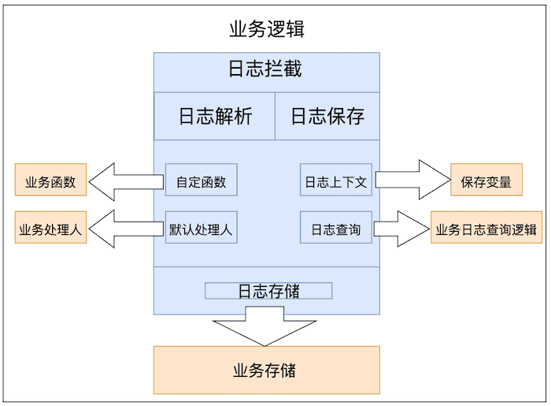

# 日志模块

## 访问日志

> 记录所有web交互请求

### 1.引入坐标

```xml
     <dependency>
            <groupId>com.lovecyy</groupId>
            <artifactId>relaxed-common-log-access</artifactId>
            <version>${version}</version>
      </dependency>
```

### 2.添加配置

```java
@Configuration
@Slf4j
@ConditionalOnWebApplication
@RequiredArgsConstructor
@ConditionalOnProperty(prefix = LogAccessProperties.PREFIX, name = "enabled", havingValue = "true",
		matchIfMissing = true)
public class AccessLogAutoConfiguration {

	private final LogProperties logProperties;

	@Bean
	@ConditionalOnClass(AccessLogHandler.class)
	public FilterRegistrationBean<AccessLogFilter> accessLogFilterRegistrationBean(
			@Nullable AccessLogHandler<?> accessLogHandler) {
		log.debug("access log 记录拦截器已开启====");

		AccessLogHandler useAccessLogHandler = accessLogHandler == null ? new DefaultAccessLogHandler()
				: accessLogHandler;
		// 默认的日志记录规则 记录所有
		LogAccessRule defaultRule = new LogAccessRule();
		defaultRule.setUrlPattern("*");

		AccessLogFilter accessLogFilter = new AccessLogFilter(logProperties.getAccess(), useAccessLogHandler,
				defaultRule);
		FilterRegistrationBean<AccessLogFilter> registrationBean = new FilterRegistrationBean<>(accessLogFilter);
		registrationBean.setOrder(-10);
		return registrationBean;
	}

}

```

### 3.定义处理器(可选)

定义bean继承`AbstractAccessLogHandler`基类即可,若不自定义，则采用默认配置`DefaultAccessLogHandler`

```java
@Slf4j
public class TestAccessLogHandler extends AbstractAccessLogHandler<AccessLog> {

	public static final String TRACE_ID = "traceId";
	/**
	 * 是否应该记录日志 可以过滤一些不需要记录日志的请求
	 * 此处过滤优先级高于 urlRules
	 * @param request
	 * @return true 记录 false 不记录
	 */
	default boolean shouldLog(HttpServletRequest request) {
		return true;
	}
	@Override
	public AccessLog beforeRequest(HttpServletRequest request, LogAccessRule logAccessRule) {
		AccessLog paramMap = new AccessLog();
		Object matchingPatternAttr = request.getAttribute(HandlerMapping.BEST_MATCHING_PATTERN_ATTRIBUTE);
		String matchingPattern = matchingPatternAttr == null ? "" : String.valueOf(matchingPatternAttr);
		String uri = URLUtil.getPath(request.getRequestURI());
		paramMap.setTraceId(MDC.get(TRACE_ID));
		paramMap.setUri(uri);
		paramMap.setMethod(request.getMethod());
		paramMap.setIp(IpUtils.getIpAddr(request));
		paramMap.setMatchingPattern(matchingPattern);
		paramMap.setUserAgent(request.getHeader("user-agent"));
		paramMap.setCreatedTime(LocalDateTime.now());
		return paramMap;
	}

	@Override
	public void afterRequest(AccessLog buildParam, HttpServletRequest request, HttpServletResponse response,
			Long executionTime, Throwable myThrowable, LogAccessRule logAccessRule) {
		buildParam.setUpdatedTime(LocalDateTime.now());
		buildParam.setTime(executionTime);
		buildParam.setHttpStatus(response.getStatus());
		buildParam.setErrorMsg(Optional.ofNullable(myThrowable).map(Throwable::getMessage).orElse(""));
		LogAccessRule.RecordOption recordOption = logAccessRule.getRecordOption();
		LogAccessRule.FieldFilter fieldFilter = logAccessRule.getFieldFilter();

		// 记录请求
		if (recordOption.isIncludeRequest()) {
			String matchRequestKey = fieldFilter.getMatchRequestKey();
			// 获取普通参数
			String params = getParams(request, matchRequestKey);
			buildParam.setReqParams(params);
			// 非文件上传请求，记录body，用户改密时不记录body
			// TODO 使用注解控制此次请求是否记录body，更方便个性化定制
			if (!isMultipartContent(request)) {
				buildParam.setReqBody(getRequestBody(request, matchRequestKey));

			}
		}
		// 记录响应
		if (recordOption.isIncludeResponse()) {
			String matchResponseKey = fieldFilter.getMatchResponseKey();
			buildParam.setResult(getResponseBody(request, response, matchResponseKey));
		}

		String header = getHeader(request);
		log.info("\n请求头:\n{}\n请求记录:\n{}", header, convertToAccessLogStr(buildParam));

	}

	/**
	 * 判断是否是multipart/form-data请求
	 * @param request 请求信息
	 * @return 是否是multipart/form-data请求
	 */
	public boolean isMultipartContent(HttpServletRequest request) {
		// 获取Content-Type
		String contentType = request.getContentType();
		return (contentType != null) && (contentType.toLowerCase().startsWith("multipart/"));
	}

	public String convertToAccessLogStr(AccessLog accessLog) {
		String LINE_SEPARATOR = System.lineSeparator();
		StringBuilder reqInfo = new StringBuilder().append("traceId:").append(accessLog.getTraceId())
				.append(LINE_SEPARATOR).append("userId:").append(accessLog.getUserId()).append(LINE_SEPARATOR)
				.append("userName:").append(accessLog.getUsername()).append(LINE_SEPARATOR).append("uri:")
				.append(accessLog.getUri()).append(LINE_SEPARATOR).append("matchingPattern:")
				.append(accessLog.getMatchingPattern()).append(LINE_SEPARATOR).append("method:")
				.append(accessLog.getMethod()).append(LINE_SEPARATOR).append("userAgent:")
				.append(accessLog.getUserAgent()).append(LINE_SEPARATOR).append("reqParams:")
				.append(accessLog.getReqParams()).append(LINE_SEPARATOR).append("reqBody:")
				.append(accessLog.getReqBody()).append(LINE_SEPARATOR).append("httpStatus:")
				.append(accessLog.getHttpStatus()).append(LINE_SEPARATOR).append("result:")
				.append(accessLog.getResult()).append(LINE_SEPARATOR).append("errorMsg:")
				.append(accessLog.getErrorMsg()).append(LINE_SEPARATOR).append("time:").append(accessLog.getTime())
				.append(LINE_SEPARATOR).append("createdTime:").append(accessLog.getCreatedTime())
				.append(LINE_SEPARATOR);
		return reqInfo.toString();
	}

}

```


## 操作日志

> 记录关键web任务请求

### 1.引入坐标

```xml
        <dependency>
            <groupId>com.lovecyy</groupId>
            <artifactId>relaxed-common-log-operation</artifactId>
            <version>${version}</version>
        </dependency>
```

### 2.注册自动配置

```java
@Configuration
public class OperationLogAutoConfiguration {

	/**
	 * 注册操作日志Aspect
	 * @return OperationLogAspect
	 */
	@Bean
	@ConditionalOnBean(OperationLogHandler.class)
	public <T> OperationLogAspect<T> operationLogAspect(OperationLogHandler<T> operationLogHandler) {
		return new OperationLogAspect<>(operationLogHandler);
	}

}
```

### 3.定义处理器

定义bean实现`OperationLogHandler`接口即可

```java
@Override
	public OperationLog buildLog(Log log, ProceedingJoinPoint proceedingJoinPoint) {
		// 获取 Request

		HttpServletRequest request = WebUtils.getRequest();

		// @formatter:off
        OperationLog operationLog = new OperationLog()
                .setCreateTime(LocalDateTime.now())
                .setIp(IpUtils.getIpAddr(request))
                .setMethod(request.getMethod())
                .setUserAgent(request.getHeader("user-agent"))
                .setUri(URLUtil.getPath(request.getRequestURI()))
                .setType(log.type())
                .setMsg(log.msg())
                .setParams(getParams(proceedingJoinPoint))
                .setTraceId(MDC.get(LogConstant.TRACE_ID));
        // @formatter:on

		// 操作用户
		return operationLog;
	}

	@Override
	public OperationLog fillExecutionInfo(OperationLog operationLog, ProceedingJoinPoint proceedingJoinPoint,
			long startTime, long endTime, Throwable throwable, boolean isSaveResult, Object result) {
		// 执行时长
		operationLog.setTime(endTime - startTime);
		// 执行状态
		LogStatusEnum logStatusEnum = throwable == null ? LogStatusEnum.SUCCESS : LogStatusEnum.FAIL;
		operationLog.setStatus(logStatusEnum.getValue());
		// 执行结果
		if (isSaveResult) {
			Optional.ofNullable(result).ifPresent(x -> operationLog.setResult(JSONUtil.toJsonStr(x)));
		}
		return operationLog;
	}

	@Override
	public void handleLog(OperationLog operationLog) {
		// 异步保存
		log.info("操作日志:{}", operationLog);
	}
```

### 4.使用方式

在指定web方法上添加`@Log`即可。

```java
	@GetMapping("/common")
	@Log(group = "日志管理", msg = "公共调用", type = 6)
	public R common(String param) {
		log.info("params: {}", param);
		return R.ok();
	}
```


## 业务日志

### 功能概要：

操作日志: 描述主要是对某个对象进行新增操作或者修改操作后记录下这个新增或者修改，操作日志要求可读性比较强，因为它主要是给用户看的，比如订单的物流信息，用户需要知道在什么时间发生了什么事情。再比如，客服对工单的处理记录信息。

解决的问题是： 「谁」在「什么时间」对「什么」做了「什么事」。

常见格式：

1. 单纯的文字记录，比如：2021-09-16 10:00 订单创建。

2. 简单的动态的文本记录，比如：2021-09-16 10:00 订单创建，订单号：NO.11089999，其中涉及变量订单号“NO.11089999”。

3. 修改类型的文本，包含修改前和修改后的值，比如：2021-09-16 10:00 用户小明修改了订单的配送地址：从“金灿灿小区”修改到“银盏盏小区” ，其中涉及变量配送的原地址“金灿灿小区”和新地址“银盏盏小区”。

4. 修改表单，一次会修改多个字段。


### 功能特性

+ 支持`SpEL`表达式
+ 自定义上下文
+ 自定义函数 
+ Diff功能 实体、json、html

### 流程图



### 概念解析

#### 模板表达式

程序执行流程带{{}}则走增强spel解析，否则回退到默认spel解析。
```
模板表达式分为两种，如下：

- `{func{params}}`形式。增强Spel（推荐）

  字段:  {{#field1,#field2...}}

  函数：{fucn{#field1,#field2...}}

- `#xxx`原始spel表达式。

  字段：#user.username 

  函数：func(#user.field1,#user.field2...)
```
#### 全局变量

| 字段    | 类型   | 描述                    |
| ------- | ------ | ----------------------- |
| _stime  | long   | 方法开始时间戳 13位     |
| _etime  | long   | 方法结束时间戳 13位     |
| _result | object | 方法执行结果            |
| _errMsg | string | 错误消息概要，最大200位 |

#### 关联注解

#####  `@BizLog`

业务日志记录注解

| 字段              | 类型    | 描述                                                         |
| ----------------- | ------- | ------------------------------------------------------------ |
| systemName        | string  | 系统名称，默认取spring.application.name(注解优先)            |
| success           | string  | 函数执行成功描述文本(支持Spel)                               |
| fail              | string  | 函数执行失败描述文本(支持Spel)                               |
| operator          | string  | 操作者，空则从`IOperatorGetService`获取。(注解优先)(支持Spel) |
| type              | string  | 操作类型(支持Spel)                                           |
| bizNo             | string  | 业务标识对象(支持Spel)                                       |
| detail            | string  | 扩展参数，记录日志详情(支持Spel)                             |
| condition         | string  | 是否需要记录日志，默认为true(支持Spel)                       |
| recordReturnValue | boolean | 是否记录返回值，默认为true                                   |

##### @LogFunc

函数标记注解

| 字段      | 类型   | 描述                       |
| --------- | ------ | -------------------------- |
| namespace | string | 函数                       |
| funcName  | string | 方法名                     |
| around    | string | 执行时机，当前仅before可用 |


## 使用方式

### 引入坐标

```xml
     <dependency>
                <groupId>com.lovecyy</groupId>
                <artifactId>relaxed-common-log-biz</artifactId>
                <version>${revision}</version>
   </dependency>
```

### 基础使用

> 只需要在执行方法上添加注解即可，不侵入业务。

```java
  @BizLog(success = "'simpleMethod执行成功'",bizNo = "{{#logUser.bizNo}}")
    public String simpleMethod(LogUser logUser){
        //业务处理逻辑
        return "method [simpleMethod] exec success!!!";
    }
```

日志记录执行结果如下

```json
{
	"systemName": "log-record",
	"className": "com.relaxed.common.log.test.biz.service.BizLogService",
	"methodName": "simpleMethod",
	"bizNo": "1737374512544227328",
	"startTime": 1703057337328,
	"endTime": 1703057337336,
	"success": true,
	"successText": "simpleMethod执行成功",
	"result": "method [simpleMethod] exec success!!!",
	"expressionMap": {
		"{{#logUser.bizNo}}": "1737374512544227328",
		"'simpleMethod执行成功'": "simpleMethod执行成功",
		"true": "true"
	},
	"funcValMap": {}
}
```

### 上下文变量

调用`LogOperatorContext#push`方法，仅支持单线程，多线程需要自定义上下文传递。

```java
    @BizLog(success = "'simpleMethod 执行成功'",bizNo = "{{#logUser.bizNo}}",detail = "物流投递到{{#deliveryAddress}}")
    public String simpleMethodContext(LogUser logUser){
        String deliveryAddress  = "上海市普陀区长寿路1888号";
        LogOperatorContext.push("deliveryAddress",deliveryAddress);
        return "method [simpleMethodContext] exec success!!!";
    }
```

日志结果

```json
{
	"systemName": "log-record",
	"className": "com.relaxed.common.log.test.biz.service.BizLogService",
	"methodName": "simpleMethodContext",
	"bizNo": "1737384448946991104",
	"startTime": 1703059715126,
	"endTime": 1703059715136,
	"success": true,
	"successText": "simpleMethod 执行成功",
	"result": "method [simpleMethodContext] exec success!!!",
	"details": "物流投递到上海市普陀区长寿路1888号",
	"expressionMap": {
		"物流投递到{{#deliveryAddress}}": "物流投递到上海市普陀区长寿路1888号",
		"{{#logUser.bizNo}}": "1737384448946991104",
		"'simpleMethod 执行成功'": "simpleMethod 执行成功",
		"true": "true"
	},
	"funcValMap": {}
}
```


### 自定义函数

> 函数定义体，必须要被bean管理！！！

#### 接口方式

```java
@Component
public class CustomInterfaceFunc implements IParseFunc {
	@Override
	public String namespace() {
		return "ifunc";
	}
	@Override
	public String name() {
		return "test";
	}
	@Override
	public String around() {
		return"";
	}
	@Override
	public String apply(Object[] args) {
		return "i func test success,params" + StrUtil.join(",", args);
	}

}

```


#### 注解方式

> 类上必须使用LogFunc注解，且被bean管理，参数不需要指定。

在对应的方法上也标注 `@LogFunc`即可

```java
@Component
@LogFunc
public class CusAnnotationFunc {

	@LogFunc
	public static String testAnnotation(Integer arg) {
		return "test annotation method success" + arg;
	}

	@LogFunc
	public String testAnnotationNoStatic() {
		return "test annotation non static method success";
	}

}
```

#### 使用方式

```java
   @BizLog(success = "'simpleMethod函数执行成功'",bizNo = "{{#logUser.bizNo}}",detail = "静态方法结果{testAnnotation{#logUser.status}},普通方法{testAnnotationNoStatic{}}," +
            "接口方法{ifunc_test{#_result}}")
    public String simpleMethodCustomFunc(LogUser logUser){

        return "method [simpleMethodContext] exec success!!!";
    }
```

#### 执行结果

```json
{
	"systemName": "log-record",
	"className": "com.relaxed.common.log.test.biz.service.BizLogService",
	"methodName": "simpleMethodCustomFunc",
	"bizNo": "1737395771501490176",
	"startTime": 1703062405964,
	"endTime": 1703062405983,
	"success": true,
	"successText": "simpleMethod函数执行成功",
	"result": "method [simpleMethodContext] exec success!!!",
	"details": "静态方法结果test annotation method success1,普通方法test annotation non static method success,接口方法i func test success,params method [simpleMethodContext] exec success!!!",
	"expressionMap": {
		"{{#logUser.bizNo}}": "1737395771501490176",
		"true": "true",
		"'simpleMethod函数执行成功'": "simpleMethod函数执行成功",
		"静态方法结果{testAnnotation{#logUser.status}},普通方法{testAnnotationNoStatic{}},接口方法{ifunc_test{#_result}}": "静态方法结果test annotation method success1,普通方法test annotation non static method success,接口方法i func test success,params method [simpleMethodContext] exec success!!!"
	},
	"funcValMap": {
		"testAnnotation#logUser.status": "test annotation method success1",
		"testAnnotationNoStatic": "test annotation non static method success",
		"ifunc_test#_result": "i func test success,params method [simpleMethodContext] exec success!!!"
	}
}
```

### 日志增强

原始日志信息不全，需要进行日志补充。实现`ILogBizEnhance`此接口，注册成bean即可。扩展参数统一放入属性`enhanceData`里面。

若需要进行注解增强，需要自行研究代码进行微调。

### 自定义日志记录

只需要实现`ILogRecordService`接口，注册成bean即可

```java
@Slf4j
public class DefaultLogRecordService implements ILogRecordService {

	@Override
	public void record(LogBizInfo logBizInfo) {
		//自定义业务逻辑处理，建议异步推送日志
        log.info("[触发默认业务日志记录]=====>log={}", JSONUtil.toJsonStr(logBizInfo));
	}

}
```

## Starter方式

### 1.引入坐标

```xml
        <dependency>
            <groupId>com.lovecyy</groupId>
            <artifactId>relaxed-spring-boot-starter-log</artifactId>
            <version>${version}</version>
        </dependency>
```

### 2.配置yml

> 启用日志时，需配置对应的处理器。映射表见下文。

```yml
relaxed:
  log:
    access:
      enabled: true
      #url规则列表(可选)
      urlRules:
          #匹配路径
        - urlPattern: /test/log/**/form
          #日志选项
          recordOption:
            #是否忽略 默认为false
            ignore: false
            #记录请求 默认true
            includeRequest: true
            #记录响应 默认true
            includeResponse: true
          #字段级别过滤规则 
          #此示例过滤请求username 响应password
          #请求参数:{"username":"zs","password":"12"}
          #响应参数:{"username":"zs","password":"12"}
          fieldFilter:
            #匹配请求参数路径名
            matchRequestKey: username
            #匹配响应参数路径名
            matchResponseKey: password

    operation:
      enabled: true
    biz:
      enabled: true
```

日志处理器映射表，每种日志增强接口，具体情况请参考代码即可。

使用方式参见上文关联描述。

访问日志

+ `AccessLogHandler`实现此接口，并注册成bean。

操作日志

+ `OperationLogHandler`实现此接口，并注册成bean。

业务日志

+ `ILogRecordService` 实现此接口,注册成bean。


## 参考资料:

[美团技术博客](https://tech.meituan.com/2021/09/16/operational-logbook.html)

[idea注解自动补全](https://www.jetbrains.com/help/idea/using-language-injections.html#cancel-injections)